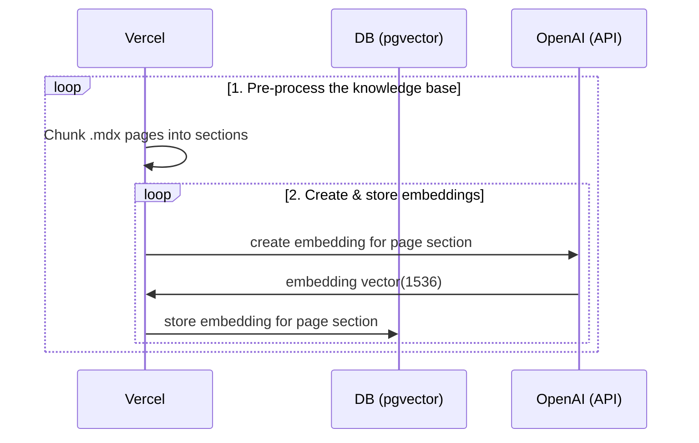
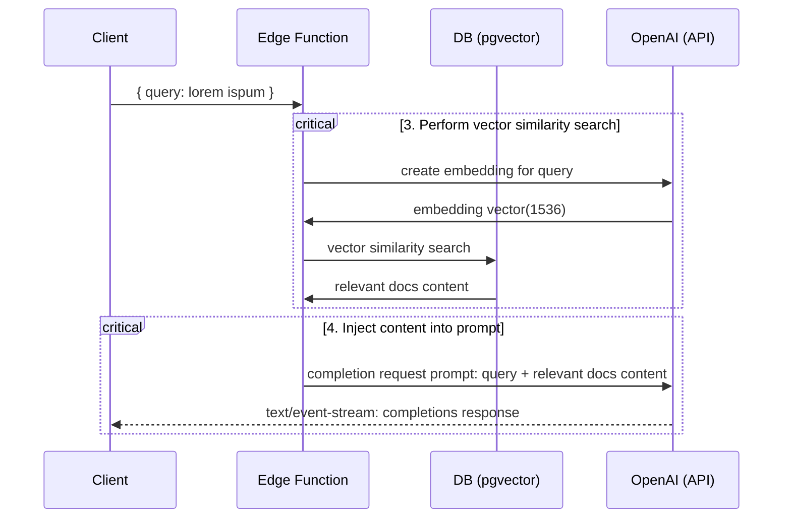

# Next.js OpenAI Doc Search Starter

This starter takes all the `.mdx` files in the `pages` directory and processes them to use as custom context within [OpenAI Text Completion](https://platform.openai.com/docs/guides/completion) prompts.

## Deploy

### Deploy to Azion Edge Platform

Deploy this starter to Azion Edge Platform using the Azion CLI for optimal performance and global distribution.

#### Deployment Steps

0. Install packages:
```bash
yarn install
```

1. Initialize your Azion project:
```bash
azion -t <AZION_TOKEN>
azion link # with opennext project
```

2. Deploy your application:
```bash
azion deploy # or azion deploy --local
azion sync
```

Your application will be deployed to Azion's global edge network for optimal performance.

## Technical Details

Building your own custom ChatGPT involves four steps:

1. [👷 Build time] Pre-process the knowledge base (your `.mdx` files in your `pages` folder).
2. [👷 Build time] Store embeddings in Postgres with [pgvector](https://supabase.com/docs/guides/database/extensions/pgvector).
3. [🏃 Runtime] Perform vector similarity search to find the content that's relevant to the question.
4. [🏃 Runtime] Inject content into OpenAI GPT-3 text completion prompt and stream response to the client.

## 👷 Build time

Step 1. and 2. happen at build time, e.g. when Vercel builds your Next.js app. During this time the [`generate-embeddings`](./lib/generate-embeddings.ts) script is being executed which performs the following tasks:



In addition to storing the embeddings, this script generates a checksum for each of your `.mdx` files and stores this in another database table to make sure the embeddings are only regenerated when the file has changed.

## 🏃 Runtime

Step 3. and 4. happen at runtime, anytime the user submits a question. When this happens, the following sequence of tasks is performed:



The relevant files for this are the [`SearchDialog` (Client)](./components/SearchDialog.tsx) component and the [`vector-search` (Edge Function)](./pages/api/vector-search.ts).

The initialization of the database, including the setup of the `pgvector` extension is stored in the [`supabase/migrations` folder](./supabase/migrations/) which is automatically applied to your local Postgres instance when running `supabase start`.

## Database Configuration

### Option 1: Remote Supabase Database (Recommended for Production)

For production deployments, use a hosted Supabase instance:

1. **Create a Supabase Project:**
   - Go to [https://app.supabase.com](https://app.supabase.com)
   - Create a new project
   - Wait for the database to be provisioned

2. **Configure Database Schema:**
   ```bash
   # Install Supabase CLI if not already installed
   npm install -g supabase
   
   # Link to your remote project
   supabase link --project-ref your-project-ref
   
   # Push migrations to remote database
   supabase db push
   ```

3. **Get Database Credentials:**
   - Navigate to Settings > API in your Supabase dashboard
   - Copy the Project URL and anon/service_role keys

4. **Update Environment Variables:**
   ```bash
   azion sync
   ```

   Or update your `.env` file for local development:
   ```env
   NEXT_PUBLIC_SUPABASE_URL=https://your-project.supabase.co
   NEXT_PUBLIC_SUPABASE_ANON_KEY=your-anon-key
   SUPABASE_SERVICE_ROLE_KEY=your-service-role-key
   OPENAI_KEY=your-openai-key
   ```

### Option 2: Local Supabase Development

#### Configuration

- `cp .env.example .env`
- Set your `OPENAI_KEY` in the newly created `.env` file.
- Set `NEXT_PUBLIC_SUPABASE_ANON_KEY` and `SUPABASE_SERVICE_ROLE_KEY` run:
  > Note: You have to run supabase to retrieve the keys.

#### Start Supabase

Make sure you have Docker installed and running locally. Then run

```bash
supabase start
```

To retrieve `NEXT_PUBLIC_SUPABASE_ANON_KEY` and `SUPABASE_SERVICE_ROLE_KEY` run:

```bash
supabase status
```

## Local Development

### Start the Next.js App

In a new terminal window, run

```bash
azion dev
```

> **Note:** If using a remote Supabase database, make sure your environment variables are properly configured before running the development server.

### Using your custom .mdx docs

1. By default your documentation will need to be in `.mdx` format. This can be done by renaming existing (or compatible) markdown `.md` file.
2. Run `pnpm run embeddings` to regenerate embeddings.
   > **Note:** 
   > - For local development: Make sure supabase is running. To check, run `supabase status`. If is not running run `supabase start`.
   > - For remote database: Ensure your environment variables are configured with the remote Supabase credentials.
3. Run `pnpm dev` again to refresh NextJS localhost:3000 rendered page.

### Production Deployment with Custom Docs

When deploying to production with custom documentation:

1. **Update your documentation** in the `pages` directory
2. **Generate embeddings** for production:
   ```bash
   # Make sure your production environment variables are set
   yarn run embeddings
   ```
3. **Deploy to Azion:**
   ```bash
   azion deploy
   azion sync
   ```

The embeddings will be automatically generated during the build process and stored in your remote Supabase database.

## Learn More

- Read the blogpost on how we built [ChatGPT for the Supabase Docs](https://supabase.com/blog/chatgpt-supabase-docs).
- [[Docs] pgvector: Embeddings and vector similarity](https://supabase.com/docs/guides/database/extensions/pgvector)
- Watch [Greg's](https://twitter.com/ggrdson) "How I built this" [video](https://youtu.be/Yhtjd7yGGGA) on the [Rabbit Hole Syndrome YouTube Channel](https://www.youtube.com/@RabbitHoleSyndrome):

[](https://www.youtube.com/watch?v=Yhtjd7yGGGA)

## Licence

Apache 2.0
